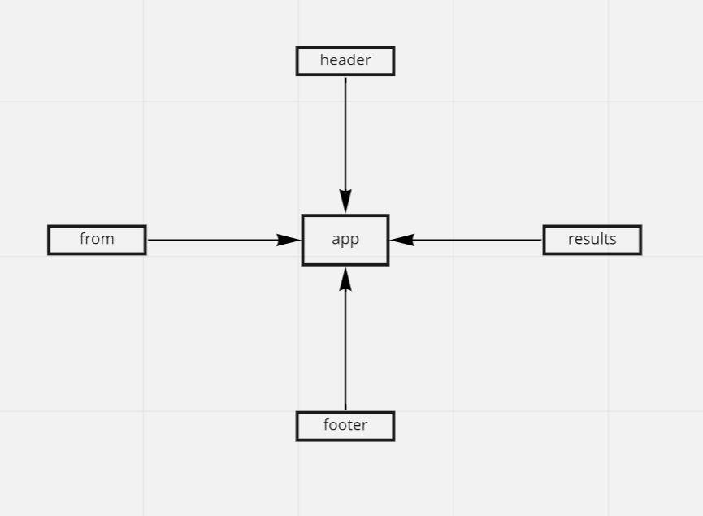

# Component Based UI

## Description  

- Begin with installing and running the application, making note of it's architecture  

- The App component serves as the container for all sub-components of this application  

  - Leave this component as a Class  
  - The app imports an .scss file to serve as the base design for the site  
  - Header, Footer, Results and Form components are imported from other files using ES6 import syntax  

- Each of the components use their own .scss file for styling  

- The <Form> component should:  

  - Call back to the <App/> component via function sent down through a prop so that the app can begin the process  

- The <Results/> component should show mock API results  
## links: 
- [gitHub Actions](https://github.com/awwadsaeed/resty/pull/4)
- [netlify](https://peaceful-meninsky-ebd275.netlify.app/)
- [sand box](https://codesandbox.io/s/reverent-mayer-qzc6x)  
## UML  

